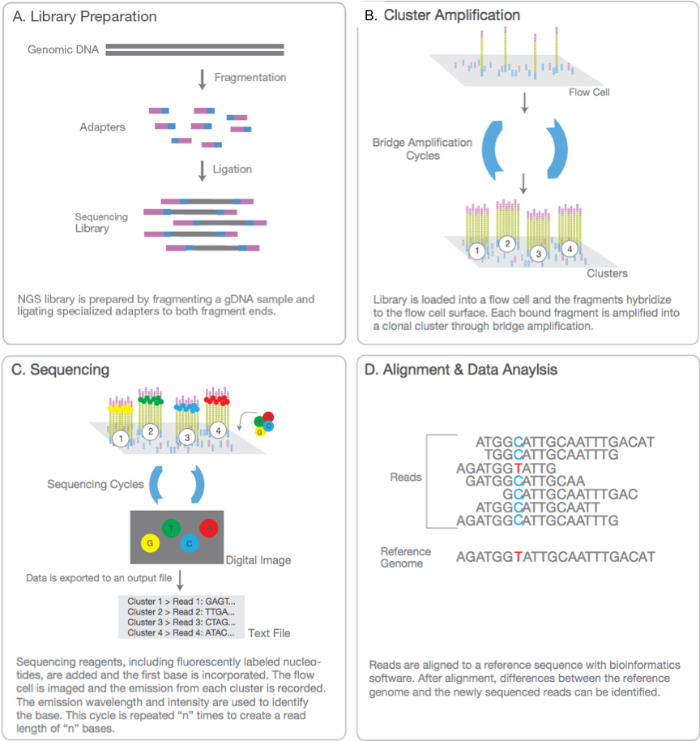
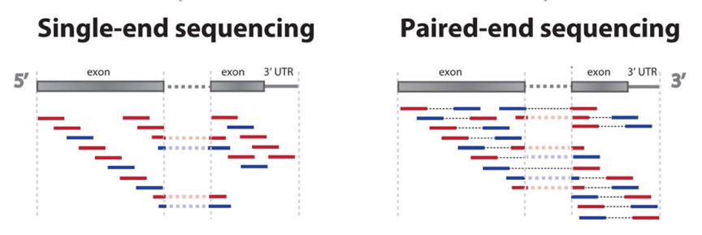

# Appendix III. Mapping Protocol
## Next-Generation Sequencing(NGS)
\(adapted from https://www.ramaciotti.unsw.edu.au/wp-content/uploads/2015/09/illumina_sequencing_introduction.pdf\)

The textbook definition of _Next-Generation Sequencing(NGS)_ is a high-throughput DNA sequencing methodology that makes use of parallelization to process up to half a million sequences concurrently. It is being used to (re)sequence genomes, determine the DNA-binding sites of proteins (ChIP-seq), sequence transcriptomes (RNA-seq). Compared to traditional(Sanger) sequencing, NGS is faster and ~1000x less expensive. 

In principle, the workflows behind NGS technology includes several steps (Figure1):
* Library Preparation—The sequencing library is prepared by random fragmentation of the DNA or cDNA sample, followed by 5’ and 3’ adaptor ligation.Adapter-ligated fragments are then PCR amplified and gel purified. 
* Cluster Generation—For cluster generation, the library is loaded on a lawn of surfaces bound with oligos complementary to the library adapters. Each fragment is then amplified into distinct,clonal clusters through bridge amplification. 
* Sequencing—DNA polymerase catalyzes the incorporation of fluorescently labeled deoxyribonucleotide triphosphates(dNTPs) into a DNA template strand during sequential cycles of DNA synthesis and nucleotide is identified by fluorophore excitation. 
* Data Analysis

Detail information can be referred [here](https://www.youtube.com/watch?v=fCd6B5HRaZ8)

## Sequencing type
* Single-End Sequencing:
Single-read sequencing involves sequencing DNA from only one end, and is the simplest way for sequencing (Figure 2). 

* Paired-End Sequencing:
A major advance in NGS technology occurred with the development of pair-end (PE) sequencing (Figure 2). PE sequencing enables both ends of the DNA fragment to be sequenced. 

## Directional RNA-seq data,which parameters to choose?
\(adapted from: [https://chipster.csc.fi/manual/library-type-summary.html](https://chipster.csc.fi/manual/library-type-summary.html)\)

It is often desirable to create libraries that retain the **strand orientation** of the original RNA targets. For example, in some cases transcription creates anti-sense RNA constructs that may play a role in regulating gene expression. In fact, long noncoding RNA (lncRNA) analysis depends on directional RNA sequencing. Methods for preparing directional RNA-seq libraries are now readily available and different tools and softwares have different options to take these into account (Figure 3).

In general, there are three types of library preps:

* un-stranded 
* "second-strand" = directional, where the first read of the read pair \(or in case of single end reads, the only read\) is from the transcript strand 
* "first-strand" = directional, where the first read \(or the only read in case of SE\) is from the opposite strand.

\(borrowed from: [http://onetipperday.sterding.com/2012/07/how-to-tell-which-library-type-to-use.html](http://onetipperday.sterding.com/2012/07/how-to-tell-which-library-type-to-use.html)\)

The reads on the left are from the same strand as the transcript, and their pairs on the right are from the opposing strand. The number above the read states which read it is, the first \(/1\) or the second \(/2\). Thus, perhaps a bit unintuitively, the first case, "fr-firststrand" is such that the first read \(/1\) is actually from the opposing strand as the transcript, and second read \(/2\) is from the transcript strand.

**Why is this so important?** If you use wrong directionality parameter, in the read counting step the reads are considered to be from the wrong strand. This means that in the cases where there are no genes on that other strand, you won't get any hits, and if there are genes in the same location on the other strand, your reads are counted for that wrong gene.

**How can I check I chose correctly?** It's a good idea to check that!

**Using the tool** [RNA-seq strandedness inference and inner distance estimation using RseQC](https://chipster.csc.fi/manual/rseqc_infer_rnaseq_experiment.html): We added this tool under the **Quality control** category to help you. The tool aligns subsets of the input FASTQ files against the reference genome, and this alignment is then compared to the reference annotation to deduce the strandedness. Make sure you select the correct reference when running the tool. Check out the help page of this tool for more information!

**In aligners like HISAT2 and Tophat** you can also do a comparison and check the mapping rate. Take a small subset of your reads and run HISAT2/TopHat with the different parameters and compare the results, and check the log file.

**In HTSeq** you can also run the tool with different options and check the number of reads that are not counted for any gene \(=the "no-feature reads"\). \(In Chipster, open file htseq-count-info.txt\).

**Be extra careful to assign the paired files correctly!** Using these parameters assumes you are giving the files in specific order: read1, read2. In Chipster always check from the parameters window that your files are assigned correctly.

Below we list some common library preparation kits and their corresponding parameters in different tools. **Is your kit missing from the list?** If you have the data generated with that kit and figure out the library type, please let us know too, so we can add that kit to the list below.

_Unstranded:_

Information regarding the strand is not conserved \(it is lost during the amplification of the mRNA fragments\).

**Kits:**

* TruSeq RNA Sample Prep kit

**Parameters:**

* HISAT2 / TopHat / Cufflinks / Cuffdiff: library-type fr-unstranded 
* HTSeq: stranded -- no

_Directional, first strand:_

The second read \(read 2\) is from the original RNA strand/template, first read \(read 1\) is from the opposite strand. The information of the strand is preserved as the original RNA strand is degradated due to the dUTPs incorporated in the second synthesis step.

**Kits:**

* All dUTP methods, NSR, NNSR 
* TruSeq Stranded Total RNA Sample Prep Kit 
* TruSeq Stranded mRNA Sample Prep Kit 
* NEB Ultra Directional RNA Library Prep Kit 
* Agilent SureSelect Strand-Specific

**Parameters:**

* HISAT2 / TopHat / Cufflinks / Cuffdiff: library-type fr-first \(`bowtie -fr`\)
* strand HTSeq: stranded -- reverse \(`featurecount -s 2`\)

_Directional, second strand:_

The first read \(read 1\) is from the original RNA strand/template, second read \(read 2\) is from the opposite strand. The directionality is preserved, as different adapters are ligated to different ends of the fragment.

**Kits:**

* Directional Illumina \(Ligation\), Standard SOLiD 
* ScriptSeq v2 RNA-Seq Library Preparation Kit \(ribo-seq\)
* SMARTer Stranded Total RNA 
* Encore Complete RNA-Seq Library Systems 
* NuGEN SoLo

**Parameters:**

* HISAT2 / TopHat / Cufflinks / Cuffdiff: library-type fr-secondstrand \(`bowtie -rf`\)
* HTSeq: stranded -- yes \(`featurecount -s 1`\)

Note also that the --fr/--rf/--ff or "Order of mates to align" parameter in Bowtie has similar sounding parameter options: \[--fr: "Forward/reverse", --rf: "Reverse/Forward", --ff: "Forward/forward"\]. However, these parameters are a bit different story, as they explain how the paired end reads are oriented towards each other \(-&gt; &lt;-, -&gt; -&gt; or &lt;- -&gt;\). The default \(--fr, -&gt; &lt;-\) is appropriate for Illumina's paired-end reads: it means that read 1 appears upstream of the reverse complement of read 2, or vice versa. When running TopHat, the library-type parameter is delivered to Bowtie, so the user doesn't have to worry about that too much.

