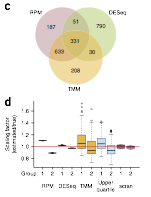

# 3.Differential Expression

## Pipeline

## Data Structure

```text
"genomes/hg38/"         # reference genomes (i.e. genome sequence and annotation)
"shared_scripts/"       # shared scripts by Lu Lab
~/github                # I sync my own scripts to github

~/proj_exRNA/
|-- RNA_index           # rerference transcriptomes (fasta and index) 
|-- sample*_name        # ...
|-- sample2_name        # different samples     
`-- sample1_name        
    |-- fastq           # raw data: fastq files
    |-- fastqc          # QC of fastq
    |-- trim            # trimmed fastq (e.g. 3' adaptor cutted)
    |-- mapped          # mapped data: SAM/BAM files
    |-- exp             # expression of each gene/ncRNA
    `-- diff_exp        # differential expression resuls
```

### **Inputs**

| **File format** | **Information contained in file** | **File description** | **Notes** |
| --- | --- |
| tsv | **gene \(microRNA\) quantifications** | Non-normalized counts. |  |

### **Outputs**

| **File format** | **Information contained in file** | **File description** | **Notes** |
| --- | --- |
| tsv | **gene \(ncRNA\) quantifications** | Non-normalized counts. |  |

## Running Scripts

### Software/Tools

> **Assumption** for most normalization and differential expression analysis tools: The expression levels of most genes are similar, i.e., not differentially expressed.

a\) **DEseq**: defines **scaling factor** \(also known as **size factor**\) estimates based on a pseudoreferencesample, which is built with the geometric mean of gene counts across all cells \(samples\).

b\) **EdgeR** \([TMM](https://www.ncbi.nlm.nih.gov/pubmed/20196867)\): trimmed mean of _M_ values


c\) **Wilcox Test using RPM**: Read counts Per Million of total mapped reads; alternatives: RPKM, TPM

> **Performance:**



### Example of single case



```bash
# genome seuqneces and annotaions
ln -s /BioII/lulab_b/shared/genomes ~/genomes
export hg38=~/genomes/human_hg38/sequence/GRCh38.p12.genome.fa
export gtf=~/genomes/human_hg38/gtf

# working space
cd ~/proj_exRNA
```



### [Example of batch job](https://github.com/lulab/training/tree/master/proj_exRNA/example_small)

## Draw Plots

## Tips/Utilities

#### XXX

```text
# XXXX
```

## Homework and more

1. Identify differential expressed genes for other RNA types. between differential conditions, i.e. Normal Control \(NC\) V.S. HCC using three methods: edgeR, DESeq2 and Wilcox/Mann-Whitney-U Test.
2. Draw Venn plot to show the difference among the above three methods.

#### More Reading and Practice[ ](https://youngleebbs.gitbooks.io/bioinformatics-training-program/content/exrna-seq-analysis/1preprocessing-mapping-and-qc.html)

* [Additional Tutorial ](../getting-startted.md#learning-materials): 3. Differential Expression Analysis


