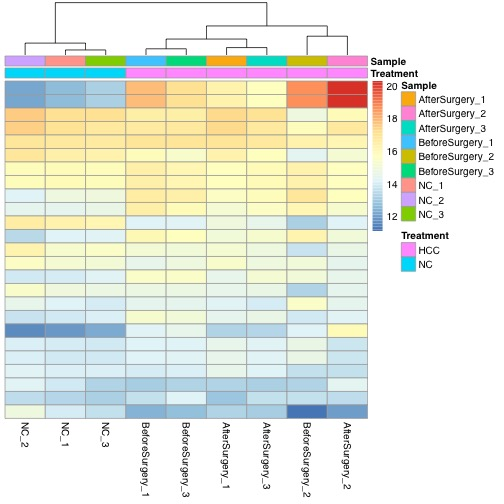
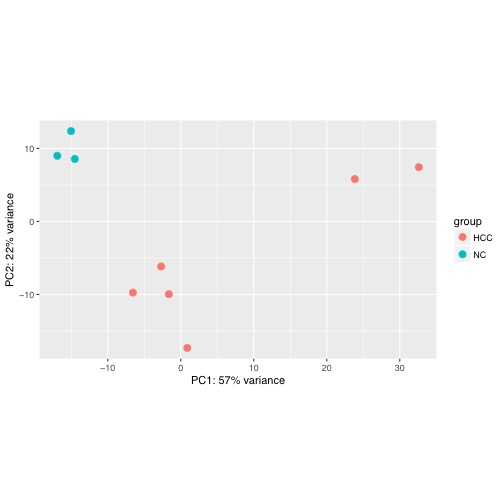
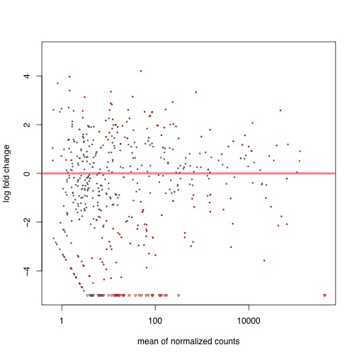
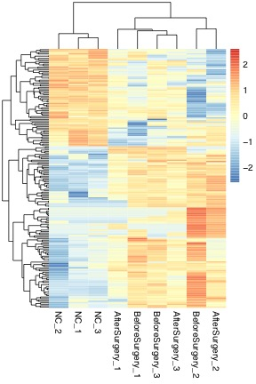

# 3.Differential Expression

## Pipeline

## Data Structure

```text
"genomes/hg38/"         # reference genomes (i.e. genome sequence and annotation)
"shared_scripts/"       # shared scripts by Lu Lab
~/github                # I sync my own scripts to github

~/proj_exRNA/
|-- RNA_index           # rerference transcriptomes (fasta and index) 
|-- sample*_name        # ...
|-- sample2_name        # different samples     
`-- sample1_name        
    |-- fastq           # raw data: fastq files
    |-- fastqc          # QC of fastq
    |-- trim            # trimmed fastq (e.g. 3' adaptor cutted)
    |-- mapped          # mapped data: SAM/BAM files
    |-- exp             # expression of each gene/ncRNA
    `-- diff_exp        # differential expression resuls
```

### **Inputs**

| **File format** | **Information contained in file** | **File description** | **Notes** |
| --- | --- |
| txt | **miRNA.homer.ct.mx** | Raw counts matrix | Used for  edgeR and DESeq2 analysis |
| txt | **miRNA.homer.rpm.mx** | RPM matrix  | Used for wilcoxon test |
| txt | **miRNA.NCvsHCC.DESeq2.ids.rpkm.mx** | RPKM matrix | Used for clustering plot |
| txt | **design.txt** | Sample info. | Classification information |

### **Outputs**

| **File format** | **Information contained in file** | **File description** | **Notes** |
| --- | --- |
| tsv | **miRNA.NCvsHCC.edgeR.tsv** | EdgeR result | LogFC, PValue and FDR |
| txt | **miRNA.homer.DESeq2.rlog.mx** | DESeq2 result | Rlog normalized counts |
| tsv | **miRNA.NCvsHCC.DESeq2.tsv** | DESeq2 result | LogFC, PValue and padj |
| tsv | **miRNA.NCvsHCC.wilcox.tsv** | Wilcox result | LogF, PVaule and FDR |
| pdf | **miRNA.NCvsHCC.DESeq2.norm.pdf** | Heatmap result | Rlog normalized count  |
| pdf | **miRNA.NCvsHCC.DESeq2.pca.pdf** | Scatter plot | PCA analysis |
| pdf | **miRNA.NCvsHCC.DESeq2.MAplot.pdf** | Scatter plot | MAplot analysis |
| pdf | **miRNA.NCvsHCC.DESeq2.Dist.pdf** | Heatmap result | Sample distance |
| pdf | **miRNA.NCvsHCC.DESeq2.ids.DE.pdf** | Heatmap result | DE genes |

## Running Scripts

### Software/Tools

> **Assumption** for most normalization and differential expression analysis tools: The expression levels of most genes are similar, i.e., not differentially expressed.

a\) **DEseq**: defines **scaling factor** \(also known as **size factor**\) estimates based on a pseudoreferencesample, which is built with the geometric mean of gene counts across all cells \(samples\).

b\) **EdgeR** \([TMM](https://www.ncbi.nlm.nih.gov/pubmed/20196867)\): trimmed mean of _M_ values


c\) **Wilcox Test using RPM**: Read counts Per Million of total mapped reads; alternatives: RPKM, TPM

> **Performance:**


### Example of single case



```r
# experimential design
design <- read.table("design.txt",sep="\t",header=T)

# expression matrix
mx <- read.table("miRNA.homer.ct.mx",sep="\t",header=T)

# filter genes
filter_genes <- apply(
    mx[,2:ncol(mx)],
    1,
    function(x) length(x[x > 2]) >= 2
)
mx_filterGenes <- mx[filter_genes,]
```



```r
library(edgeR)

#Read Data in
countData <- mx_filterGenes[,-1]
rownames(countData) <- mx_filterGenes[,1]
design <- read.table("design.txt",sep="\t",header=T)
colData <- design

# generate DGE object
y <- DGEList(countData, samples=colData, group=colData$Treatment)
y <- calcNormFactors(y)

#Estimate Error Model
design <-model.matrix(~Treatment, data=colData)
y <- estimateDisp(y, design)

# classic methods: compute p-values, then output
et <- exactTest(y)
res <- topTags(et,Inf)
tidyResult <- data.frame(Gene=rownames(res$table), res$table)
#write.table(tidyResult,file="hcc_example.miRNA.NCvsHCC.edgeR.classic.tsv", quote=F, sep="\t",row.names=FALSE)

# Generalized linear models 
fit <- glmFit(y,design)
# likelihood ratio test
lrt <- glmLRT(fit,contrast = c(1,-1))
FDR <- p.adjust(lrt$table$PValue, method="BH")
padj_lrt <- cbind(lrt$table,FDR)
fit_df <- lrt$fitted.values
#write.table(fit_df,file = "hcc_example.miRNA.homer.edgeR.TMM.mx",row.names = T, sep="\t", quote=F)
merged_lrt <- merge(fit_df,padj_lrt,by="row.names")
colnames(merged_lrt)[1] <- "Genes"
write.table(merged_lrt,file = "miRNA.NCvsHCC.edgeR.tsv",row.names = F, sep="\t", quote=F)

```



```r
library(DESeq2)
#Read Data in
countData <- mx_filterGenes
colData <- design

# generate Dataset object 
dds <- DESeqDataSetFromMatrix(countData, colData, design=~Treatment, tidy=TRUE)

# normlize using rlog method
norm <- rlog(dds,blind=FALSE)
norm_matrix <- assay(norm)
norm_df <- data.frame(Gene=rownames(norm_matrix), norm_matrix)
write.table(norm_df, "miRNA.homer.DESeq2.rlog.mx", quote=F, row.names = FALSE,sep="\t")

deg <- DESeq(dds)
res <- results(deg,tidy=TRUE)
merged_res <- merge(norm_df,res,by.x="Gene",by.y="row")
write.table(merged_res,file="miRNA.NCvsHCC.DESeq2.tsv",quote=F, sep="\t",row.names=FALSE)
```



```r
cpmMx <- read.table("miRNA.homer.rpm.mx",sep="\t",header=T)
filter_cpm <- apply(
    mx[,2:ncol(cpmMx)],
    1,
    function(x) length(x[x > 0]) >= 2
)
mx_filterCPM <- cpmMx[filter_cpm,]

myFun <- function(x){
  x = as.numeric(x)
  v1 = x[2:4]
  v2 = x[5:10]
  out <- wilcox.test(v1,v2)
  out <- out$p.value
}
p_value <- apply(mx_filterCPM,1,myFun)
p_value[is.nan(p_value)] <- 1
FDR <- p.adjust(p_value,method = "BH")
mx_filterCPM$avgNC <- apply(mx_filterCPM[,2:4],1,mean)
mx_filterCPM$avgHCC <- apply(mx_filterCPM[,5:10],1,mean)
mx_filterCPM$log2fc <- log2((mx_filterCPM$avgNC+0.25)/(mx_filterCPM$avgHCC+0.25))
results <- cbind(mx_filterCPM,p_value,FDR)
write.table(results,file = "miRNA.NCvsHCC.wilcox.tsv",row.names = F, sep="\t", quote=F)
```



```r
# 1.heatmap for DESeq2 rlog normalized count matrix
pdf("miRNA.NCvsHCC.DESeq2.norm.pdf")
library("pheatmap")
select <- order(rowMeans(counts(deg,normalized=TRUE)), decreasing=TRUE)[1:25]
df <- as.data.frame(colData(deg)[,c("Treatment","Sample")])
pheatmap(assay(norm)[select,], cluster_rows=FALSE, show_rownames=FALSE, cluster_cols=TRUE, annotation_col=df)
dev.off()

# 2.PCA analysis
pdf("miRNA.NCvsHCC.DESeq2.pca.pdf")
plotPCA(norm, intgroup=c("Treatment"))
dev.off()

# 3.MA plot
pdf("miRNA.NCvsHCC.DESeq2.MAplot.pdf")
plotMA(deg, ylim=c(-5,5))
dev.off()

# 4.distance between samples
pdf("miRNA.NCvsHCC.DESeq2.Dist.pdf")
sampleDists <- dist(t(assay(norm)))
library("RColorBrewer")
sampleDistMatrix <- as.matrix(sampleDists)
rownames(sampleDistMatrix) <- paste(norm$Treatment, norm$Sample, sep="-")
colnames(sampleDistMatrix) <- paste(norm$Treatment, norm$Sample, sep="-")
colors <- colorRampPalette( rev(brewer.pal(9, "Blues")) )(255)
pheatmap(sampleDistMatrix,
         clustering_distance_rows=sampleDists,
         clustering_distance_cols=sampleDists,
         col=colors)
dev.off()


# 5.Hierarchical clustering for differential expressed genes
awk 'BEGIN{FS=OFS="\t"}($12>1 && $15<=0.05){print $1}' hcc_example.miRNA.NCvsHCC.DESeq2.tsv > hcc_example.miRNA.NCvsHCC.DESeq2.NC_high.ids
awk 'BEGIN{FS=OFS="\t"}($12<-1 && $15<=0.05){print $1}' hcc_example.miRNA.NCvsHCC.DESeq2.tsv > hcc_example.miRNA.NCvsHCC.DESeq2.HCC_high.ids

mx <- read.table("miRNA.NCvsHCC.DESeq2.ids.DE.mx",sep="\t",head=T)
# log2 transfer the RPKM value
log2mx <- log2(mx+0.05)
pdf("miRNA.NCvsHCC.DESeq2.ids.rpkm.heatmap.pdf",width=4,height=6)
pheatmap(as.matrix(log2mx), Rowv=T, Colv=T, dendrogram = "both", trace = "none", density.info = c("none"), scale="row")
dev.off()
```



### [Example of batch job](https://github.com/lulab/training/tree/master/proj_exRNA/example_small)

## Draw Plots

### 1. H**eatmap for DESeq2 normalized count matrix**



### 2. PCA analysis



### 3. MA plot



### 4. Distance between samples


### 5. Hierarchical clustering for differential expressed genes



## Tips/Utilities

#### XXX

```text
# XXXX
```

## Homework and more

1. Identify differential expressed genes for other RNA types. between differential conditions, i.e. Normal Control \(NC\) V.S. HCC using three methods: edgeR, DESeq2 and Wilcox/Mann-Whitney-U Test.
2. Draw Venn plot to show the difference among the above three methods.

#### More Reading and Practice[ ](https://youngleebbs.gitbooks.io/bioinformatics-training-program/content/exrna-seq-analysis/1preprocessing-mapping-and-qc.html)

* [Additional Tutorial ](../getting-startted.md#learning-materials): 3. Differential Expression Analysis


